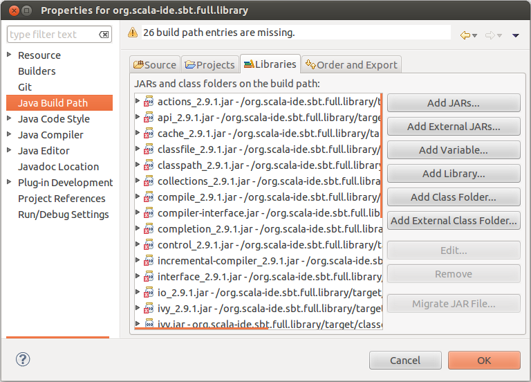

Setup
=====

In this page you will learn everything you need to know to setup the Scala IDE project in Eclipse. 
You are literally instants away from being all set and ready to start hacking the Scala IDE sources!

Requirements
------------

* `JDK 5 <http://www.oracle.com/technetwork/java/javasebusiness/downloads/java-archive-downloads-javase5-419410.html>`_ 
  or `JDK 6 <http://www.oracle.com/technetwork/java/javasebusiness/downloads/java-archive-downloads-javase6-419409.html>`_ 
  (JDK 7 is **not** supported. As a matter of fact, there have been issues reported when running Eclipse with a Java 7 JVM. For instance, 
  see https://bugs.eclipse.org/bugs/show_bug.cgi?id=364735).

* `Maven 3 <http://maven.apache.org/download.html>`_.

* `Git <http://git-scm.com/>`_ and a `GitHub <https://github.com/>`_ account.

* `Eclipse 3.7 (Indigo) <http://www.eclipse.org/downloads/>`_, including the JDT. Either "Eclipse Classic" or "Eclipse for Java Developers" is sufficient (Be aware, the plugin's sources are no longer compatible with Eclipse 3.6). 

* The `Scala IDE Helium for Scala 2.9 <http://scala-ide.org/download/nightly.html>`_.

You will also need a terminal to run some script. If you are on Windows, we suggest you to 
install `Cygwin <http://www.cygwin.com/>`_ (how could you live without it on Windows anyway!?). 
It is not mandatory to use Cygwin, but in this documentation we assume you have a way to run 
bash scripts, or else, you have the time and motivation to look inside the existing scripts and 
convert them in Windows batch files, if needed (if you do so, make sure to send a pull request our way, 
and we will make the Windows scripts available to all contributors).

.. _setup_fork-the-project:

Fork the project
----------------

The first thing you should do is forking the `Scala IDE repository <http://github.com/scala-ide/scala-ide>`_, 
that will greatly simplify the process of sending us patches (remember to also read about the 
:ref:`workflow_page` before creating pull requests).

If you are new to GitHub, `read here to learn how to fork a project 
<http://help.github.com/fork-a-repo/>`_.

After forking the project, simply open a terminal and clone your own fork to download the project's 
sources. The command for cloning the fork should be very close to the following one (mind that 
you will have to replace *<username>* with your actual Git username).

.. code-block:: bash

	$ git clone git@github.com:<username>/scala-ide.git

Make sure to `add an Upstream <http://help.github.com/fork-a-repo/#Set-Up-Your-Local-Repo>`_ pointing 
to the original Scala IDE git remote repository, so that you can keep fetching the latest changes 
made in the project, and easily integrate them back in your fork.

Now, fire up Eclipse and import the Scala IDE project. In a few moment you will be all set to start 
hacking on the Scala IDE!

Import the projects into Eclipse
--------------------------------

The Scala IDE project already contains the metadata files needed by Eclipse to setup the project. 
To import the Scala IDE in your workspace simply click on File > Import. The Eclipse Import dialog 
will open. There, select General > Existing Projects into Workspace and click Next. A new dialog 
will open. Browse to the folder that points to your cloned Scala IDE project's and select it. 

A list of projects should then be loaded in the below white area. The only projects that you absolutely 
need to import in Eclipse are ``org.scala-ide.sbt.full.library``, ``org.scala-ide.sdt.core`` and 
``org.scala-ide.sdt.core.tests``. Select only those and click Finish. 
 
There is only one more thing you need to do to get ready to hack the Scala IDE project. You will 
notice that the ``org.scala-ide.sbt.full.library`` project has build path errors. This project is 
grouping together a bunch of SBT jars into one OSGI bundle. In order to retrieve them from 
different SBT/Ivy repositories, you need to run a script from the command line. 
 
Open a terminal, go in your (local) Scala IDE project's root folder, and then 
 
.. code-block:: bash
 
	$ cd org.scala-ide.build-toolchain
 
The script to run is different depending on the Scala version packaged with the Scala IDE plug-in 
you have installed.
 
If you are using the Scala IDE with Scala 2.9
 
.. code-block:: bash
	
	$ ./build-toolchain-2.9.x.sh
	
or, if you are using Scala IDE with Scala 2.10 (trunk)
 
.. code-block:: bash
	
	$ ./build-toolchain-trunk.sh
 
After the script completes, refresh the ``org.scala-ide.sbt.full.library`` project in Eclipse. Then, 
expand the ``org.scala-ide.sbt.full.library`` project and expand the ``lib`` folder. You should 
see a number of JARs with a Scala version appended.
 
Now, right click on the ``org.scala-ide.sbt.full.library`` project and then click "Properties". A 
dialog will open. Click on "Java Build Path" and select the Libraries tab. You should see something 
on the lines of:
 

 
If you are seeing errors it means that the imported JARs do not match the ones existing in 
``org.scala-ide.sbt.full.library/lib`` folder. To fix this, first remove all JARs, and then click 
the "Add JARs..." button and browse to ``org.scala-ide.sbt.full.library/lib``. Select all JARs in the 
folder and click OK.
 
Now click the "Order and Export" tab and make sure to export all JARs click the "Select All" button. 
 

 
 
Click OK. 

Eclipse should automatically refresh the projects, but you will still see some build 
errors in the ``org.scala-ide.sbt.core`` project. The problem is that we are missing a few 
dependencies needed to compile the project's sources. To fix this, you will need to build the 
project from the terminal. Follow the steps described in :ref:`building_run-the-build`. Then, 
come back to finish the setup. 

When running the build script, Maven will take care of copying the dependecies in the 
``org.scala-ide.sbt.core`` project, inside the ``/lib`` folder. After the build completed, you should 
no longer see errors inside Eclipse. If you do still see errors, try to refresh all projects (in 
Eclipse, select all the imported Scala IDE projects and press F5) and do a full clean, 
re-build (to do so, click on the "Project" menu item, and the "Clean...").
 
If after rebuilding you still see errors, drop us a note in the `Scala IDE Developer 
Mailing List <http://groups.google.com/group/scala-ide-dev?pli=1>`_.

Run the Scala IDE within Eclipse
--------------------------------

So, you managed to have the Scala IDE sources compiling, now it's time to learn how to run the Scala 
IDE within Eclipse. 

Doing this is especially useful if you need to do some manual debugging of the plug-in. Since the 
Scala IDE uses weaving, you need to launch the IDE with weaving enabled, which is not configurable 
in the vanilla launcher. 

That is why we suggest you to install the 
`Equinox Weaving Launcher <https://github.com/milessabin/equinox-weaving-launcher>`_.

.. _setup_install-equinox-weaving-launcher:

Install the Equinox Weaving Launcher
....................................

To install the Equinox Weaving Launcher, use the following Eclipse update site:

	http://www.chuusai.com/eclipse/equinox-weaving-launcher/

This adds two more launch configurations: Eclipse Application with Equinox Weaving, and JUnit plug-in 
test with Equinox Weaving.

Create a run configuration for launching Eclipse with Scala IDE
...............................................................

To create a run configuration, right click on the ``org.scala-ide.sdt.core`` project and select 
Run As > Equinox Weaving enabled Eclipse Application.  That should fire up a second Eclipse instance. 
To quickly test that all is working fine, try to create a Scala project.

You are now ready to hack on the Scala IDE. Start by looking around, do some change and observe what 
happens when you launch the second Eclipse's instance. 

Read the rest of the developer documentation to get more insights about the overall architecture.

Additional information
----------------------

``org.scala-ide.sdt.aspects`` project
.....................................

The Scala IDE uses AspectJ to weave into Eclipse and hook in to JDT internals. If you want to work 
on JDT integration within the Scala IDE, then it is a good idea to import 
``org.scala-ide.sdt.aspects`` project in your Eclipse workspace and also install the `AspectJ 
Eclipse plug-in <http://www.eclipse.org/ajdt>`_.

Using JRebel
............

If you want to use JRebel, there are two things you need to know:

1. You can simply add ``-noverify -javaagent:path/to/javarebel.jar`` to the VM arguments in the 
   run configuration. For Windows, this is 
   ``-noverify "-javaagent:C:\Program Files (x86)\ZeroTurnaround\JRebel\jrebel.jar"``.
2. JRebel is free for Scala users, see Free JavaRebel for Scala users, ZeroTurnaround announces.
