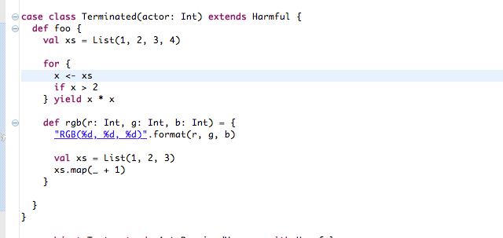
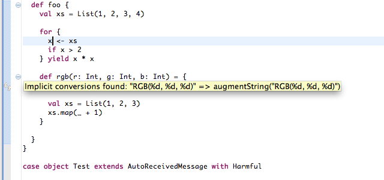

Implicit Highlighting
=====================

Implicit annotations are a very powerful feature in Scala. They allow for
fluid DSLs, an amazing collection library, or enriching existing types. With
great power comes great responsability, and a desire to control. Meet *Implicit Highlighting*!

Implicit highlighting
---------------------

Notice that the string is underlined, and a marker is added to the left
gutter. This signals that the method ``format`` was added through an implicit
conversion. If you move your mouse on the gutter, you will see the actual
conversion (``augmentString``). 

There is also a QuickFix available (``CMD-1``)
that makes the call the implicit conversion explicit!

.. image:: images/quick-fix.png
	:width: 100%
	:target: ../../_images/quick-fix.png

Configuration
-------------

By default, only *implicit conversions* are highlighted. This makes sense,
since most of the times implicit values that are passed around are not too
costly, nor interesting. However, if you'd like to show those as well, you can
enable them from the ``Implicits`` preferences page.

.. image:: images/prefs.png

Thank you
---------

This feature was contributed by Jin Mingjian and improved by David Bernard and
Mirko Stocker. Thank you!
