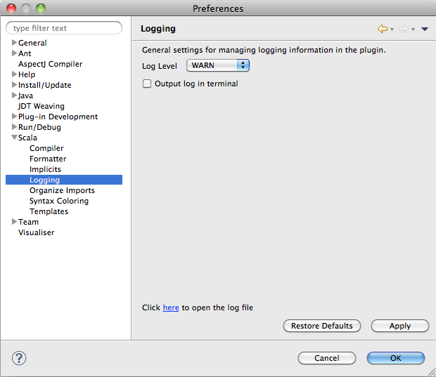

Logging
=======

Logging isn't likely to be the most wanted feature, and we hope that you won't ever need to know about it. 
But software can crash, and decent logging can go a long way into understanding the reasons behind a failure.
Thus, we have improved the logging infrastructure so that it can be easily controlled by you. 

In this page we discuss how you can manage logging in the Scala IDE.

Settings
--------

You can access the logging settings in the Eclipse Preferences. Click on the ``Scala`` item and select ``Logging``.
You should see the following page:

By default, the log level is set to ``WARN``. That should be enough for general use, and it should still provide 
some useful information in the event of an error. Naturally, you are free to change the log level at any time --
remember, though, that increasing logging may noticeably decrease performance.

All logging information is stored in a ``scala-ide.log`` file located in the ``${workspace}/.metadata/.plugins/org.scala-ide.sdt.core/`` 
directory, where ``${workspace}`` is the directory provided when starting up Eclipse -- i.e., your Eclipse workspace.
This file can grow up to 10MB, at which point it automatically rolls over. You can easily check the log's contents at
any time by clicking on the link at the bottom of the ``Logging`` preferences page.

Should you so desire, you can also output all log messages directly to the terminal.  Be aware that in order to do so
you must start Eclipse from the command line. For example, you can start Eclipse from the command line with the
following on Mac OSX:

.. code-block:: bash

	$ /Applications/eclipse/Eclipse.app/Contents/MacOS/eclipse

