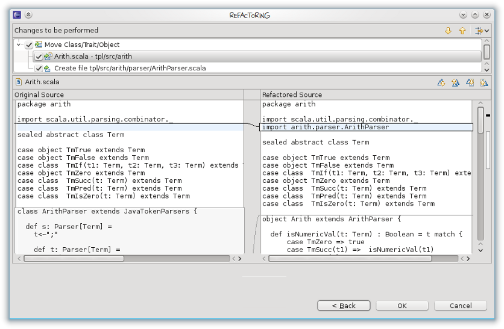

Move Class, Object or Trait Refactoring
=======================================

Move Class was an often requested feature in the Scala IDE bugtracker, so we
implemented it for the upcoming 2.1 release. The refactoring can either be
invoked from the Refactoring menu, or indirectly by drag-and-dropping a file
in the Package Explorer.

If there exists more than one top-level declaration in the file, you can choose to
split-off one of the declarations or to move them all. The refactoring will move
all the necessary imports along, and also update all the references (other
imports, or qualified names) in the project.

Here is a screenshot of the refactoring configuration dialog:

You can also create a new package directly in the wizard, and choose to move the
complete file or only the selected definition (the option is not present if no
definition was selected or if the file contains only a single one).

The resulting changes can then be previewed in the usual fashion:

A new file is created with the name of the moved class. In this preview, we can
see that the class is removed in the file and an import to its new location is
added because the class is referenced somewhere in this file.

Limitations
-----------

There currently are some limitations: the refactoring works only on Scala code,
and it simply ignores visibility issues, so moving might result in compilation
errors. This being the initial implementation, it is certainly not free of bugs,
so please `report any bug you encounter
<http://scala-ide-portfolio.assembla.com/spaces/scala-ide/support/tickets>`_.
