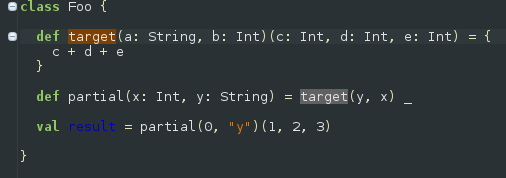
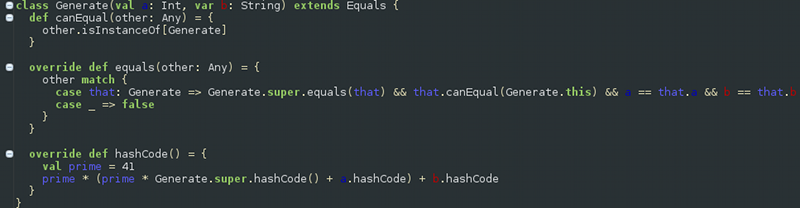
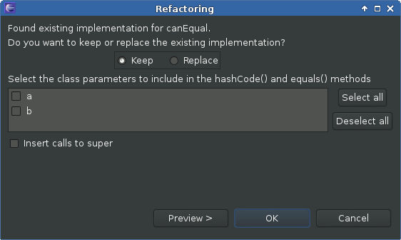
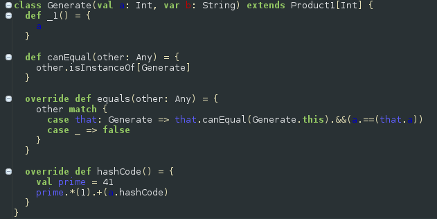
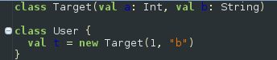

New Refactorings
################

Are you used to a *lot* of refactorings provided by your Java IDE? Well, we're trying to close the gap, take a look at the new refactorings! All new refactorings are available using the usual refactoring menus.

Method signature refactorings
=============================

All three method signature refactorings not only apply the refactoring to all usages of a method throughout the inheritance hierarchy, they also track its partial applications.

Change parameter order
----------------------
The order of the parameters in your method should be changed? *Change parameter order* allows you to reorder method parameters inside each parameter list.

To reorder the parameters of a method select its definition:

.. image:: images/change-order-before.png

In the refactoring dialog the parameters can be moved up and down in their parameter lists. The preview of the refactored method signature is always updated accordingly:

.. image:: images/change-order-dialog.png

All changes are displayed in the preview dialog:

.. image:: images/change-order-preview.png

Split parameter lists
---------------------
You want to partially apply your method but it has not enough parameter lists? *Split parameter lists* allows you to split parameter lists between each two parameters.

Again, just select the method to refactor:

In the refactoring dialog parameter lists can be split between each parameter pair using the *Split* button. A split can be reverted by using the *Merge* button.

.. image:: images/split-dialog.png

And the resulting changes in the preview dialog:

.. image:: images/split-preview.png

Merge parameter lists
---------------------
Your method doesn't need multiple parameter lists? Being the inverse refactoring to *Split parameter lists*, *Merge parameter lists* merges parameter lists that don't need to be split.

The refactoring dialog is very similar to *Split parameter lists*:

.. image:: images/merge-dialog.png

Having merged the right parameter lists we get back our original method signature from the beginning, before we applied the *Split parameter lists* refactoring:

.. image:: images/merge-preview.png

Note that there are situations where parameter lists can't be merged because they are partially applied. As an example, we can't merge the remaining two parameter lists of the method ``reorder`` because of the partial application in the method ``partial``:

.. image:: images/merge-not-possible.png

Source generators
=================

Not exactly refactorings, but since they are implemented in the Scala refactoring library they are presented here nevertheless. The following source generators can be found under the *Source* context menu that appears after right-clicking in the editor.

Generate hashCode and equals
----------------------------
*Generate hashCode and equals* generates implementations for the ``hashCode`` and ``equals`` methods based on selected class parameters. The implementations are based on the recommendations from `Programming in Scala`_. This includes a ``canEqual`` method, thus the ``Equals`` trait is mixed in as well.

.. _`Programming in Scala`: http://www.artima.com/pins1ed/object-equality.html

To start this refactoring simply select a class. As an example we will use the class ``Generate``:

In the refactoring dialog the class parameters that should be included in the equals comparison and the hashcode computation can be selected. Optionally calls to ``super`` can be inserted:

.. image:: images/hashcode-and-equals-dialog.png

Selecting both class parameters and inserting calls to ``super`` results in this:

If the original class already has existing implementations for ``canEqual``, ``equals`` or ``hashCode``, the refactoring dialog offers the option to keep those or let them be replaced by newly generated implementations:

Introduce ProductN trait
------------------------
Asked for by the community, *Introduce ProductN trait* is an extension of *Generate hashCode and equals*. In addition to *Generate hashCode and equals* this generator creates the methods ``_1`` to ``_n`` for the selected class parameters and mixes in the trait ``ProductN``, where *n* stands for the number of selected class parameters. 

The refactoring dialog is almost the same as for *Generate hashCode and equals*:

.. image:: images/productN-dialog.png

Selecting only the first parameter ``a`` and omitting calls to ``super`` results in this:

Extract trait
=============

*Extract trait* moves selected members from a class/object/trait to a new trait. If the new trait accesses non-private members of the original class/object/trait, a self type annotation is added to the new trait.

We start with a simple ``Calculator`` class:

.. image:: images/extract-trait-before.png

We select the ``mul`` method for extraction in the dialog and give the new trait the name ``Multiplicator``:

.. image:: images/extract-trait-dialog.png

The class ``Calculator`` is changed accordingly:

.. image:: images/extract-trait-preview.png

The new trait ``Multiplicator`` uses the ``add`` method from ``Calculator``, so a self type annotation needs to be added to ``Multiplicator``:

.. image:: images/extract-trait-extracted.png

Import statements are also handled: In the original class/object/trait all import statements that are not used after the extraction of the trait are removed, and in the extracted trait all needed import statements are added.

Limitations
-----------

The currently supported member types are: def, val and var. Others, as e.g. nested classes, are not (yet) supported.

Move constructor to companion object
====================================

You want to create a factory method such that the constructor of your class is not accessed directly, but tracking down and redirecting all constructor calls is cumbersome? Then *Move constructor to companion* object is here to help! It creates an ``apply`` method in the companion object (which is generated as well if necessary) that calls the constructor. All constructor calls get redirected to the new factory method.

As a simple example we start with a ``Target`` class and a class ``User`` that calls ``Target``'s constructor:

Selecting the ``Target`` class and applying the *Move constructor to companion object* refactoring creates a companion object and an ``apply`` method that wraps the constructor call. The constructor call in the ``User`` class is redirected to the new factory method.

.. image:: images/move-constructor-preview.png

Limitations
-----------
Currently this is only supported for the primary constructor (thus no refactoring dialog is needed), moving auxiliary constructors is not (yet) possible.
