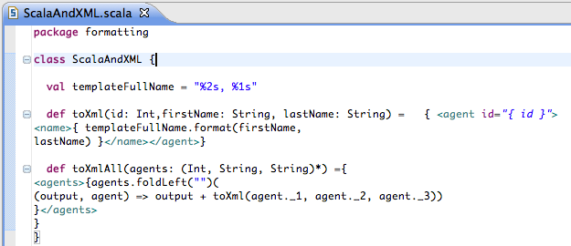
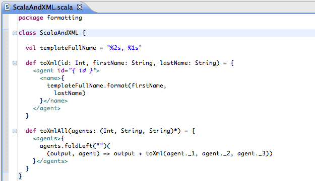

Formatting
==========

The Scala formatter `scalariform`_ is integrated in Scala IDE. It allows for a good formatting of both Scala code and XML literals.

Before:

After:

Scalariform options can be modified in the ``Scala → Formatter`` preference page.

.. _scalariform: https://github.com/mdr/scalariform
