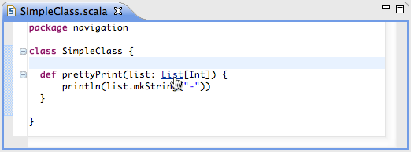

Navigating
==========

Open type
---------

The ``Open Type`` dialog used to find Java type also provide all defined Scala types. The shortcut is ``Ctrl-Shift-T`` or ``Cmd-Shift-T``.

.. image:: ../images/feature-open-type-01.png

Hyperlinking
------------

Hyperlinking to declaration is enable in the Scala editor.

It is activated by holding the ``Ctrl`` or the ``Cmd`` key, and hovering on variable, method or type. It became underlined and can be click to jump to its declaration.

Open declaration
----------------

In a similar way to hyperlinking, ``F3`` can be used to the declaration of the element currently under the caret.
