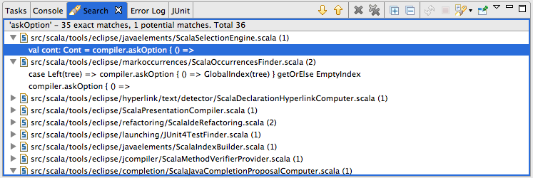

.. include:: /global_defs.hrst

Find Occurrences |new| |plugin|
===============================

.. note:: This feature requires the `Scala Search plugin`_. In the future this will be merged with the IDE

It is possible to find all occurrences of a specific Scala entity by selecting the entity in the editor and press the shortcut ``Ctrl-Alt-Shift-R`` (or ``Cmd-Alt-Shift-R`` on Mac). Currently, find references only works for members, i.e., methods and fields.

*It currently only monitors file changes that happen inside of Eclipse, so if a file is changed outside of Eclipse (e.g. by switching git branch) it might not find the correct occurrence in that document. Refreshing the workspace should help, if not, delete the indices (<workspace>/.metadata/.plugins/org.scala.tools.eclipse.search/lucene-indices). This will be fixed in the next release, see the relevant* `ticket`_. *for more information*

.. _Scala Search plugin: http://github.com/scala-ide/scala-search
.. _ticket: https://scala-ide-portfolio.assembla.com/spaces/scala-ide/tickets/1001608#/activity/ticket: