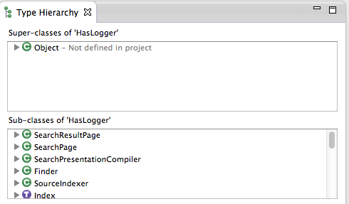

.. include:: /global_defs.hrst

Type Hierarchy |new| |plugin|
===============================

.. note:: This feature requires the `Scala Search plugin`_. In the future this will be merged with the IDE

It is possible to visualize the type hierarchy of any Scala type by putting the cursor on the type in the editor and press the shortcut ``Ctrl-F4`` (or ``Cmd-F4`` on Mac). 

.. note:: Currently, type hierarchy cannot be started from source attachments. This is a known limitation, and will be fixed in a future release.

.. _Scala Search plugin: github.com/scala-ide/scala-search