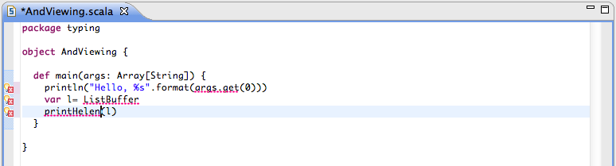

.. include:: /global_defs.hrst

As You Type Error Reporting
===========================

The Scala code is check as it is entered. It allows to see small or more complex compilation error as the code is type. No more endless cycle *code → code → code → compile → error reported → fix error → compile → error reported → fix error →...*.

