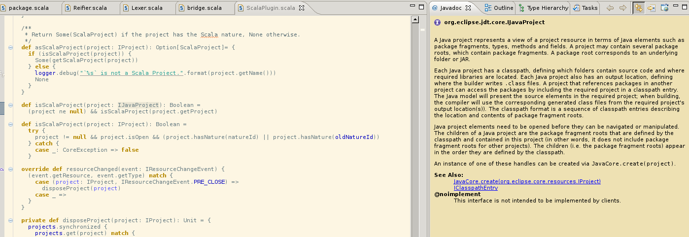

.. include:: /global_defs.hrst

Javadoc on hover
================

When hovering on a Java element, the javadoc view, if you have it
open, will show you the documentation for it. Below you can see
the result when hovering on an ``IJavaProject`` (part of the
Eclispe JDT).

