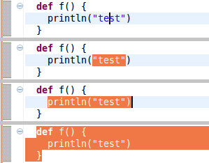

.. include:: /global_defs.hrst

Structured Selection
====================

Using ``alt+shift+up`` and ``alt+shift+down`` selects larger or smaller portion of the AST. It allows for quick selection of sub-expressions or statements.

