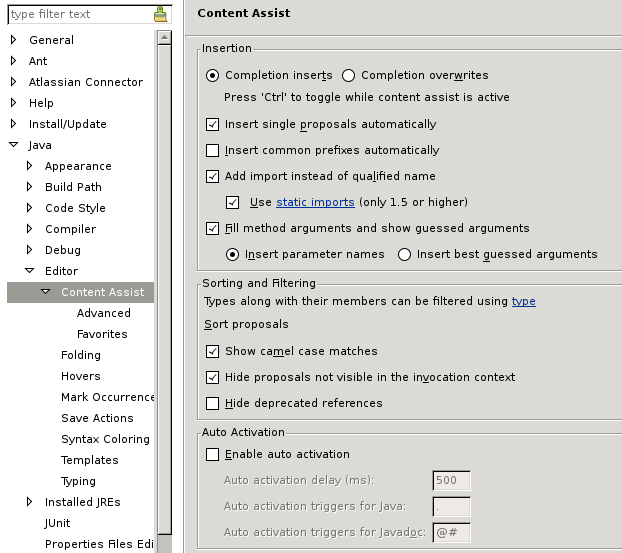
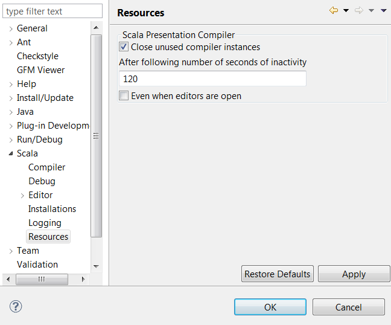

.. include:: /global_defs.hrst

Advanced Setup
==============

This page contains information to help you configure Eclipse and Scala IDE, to increase performances and ease-of-use.

Eclipse Configuration
---------------------

The default Eclipse heap configuration is often inadequate for the Scala IDE. It is strongly recommended to edit the ``eclipse/eclipse.ini`` (``eclipse/Eclipse.app/Contents/MacOS/eclipse.ini`` on Mac osX) file and add the following lines to increase various heap limits and virtual machine options:

.. code-block:: bash

   --launcher.XXMaxPermSize
   256m
   -vmargs
   -Xms256m
   -Xmx1024m
   -XX:PermSize=64m
   -Xss1M
   -server
   -XX:+DoEscapeAnalysis

One recent Oracle JVM, the following might also be beneficial:

.. code-block:: bash

   -XX:+UseConcMarkSweepGC

As is the following on Oracle 64-bits JVM:

.. code-block:: bash

   -XX:+UseCompressedOops

Required Preferences
--------------------

* **JDT Weaving**

  Scala IDE uses AOP to tweak the Eclipse JDT, so JDT weaving has to be enable. Otherwise, Scala files would be managed as Java files.

  It is set in the ``JDT Weaving`` section of Scala Setup Diagnostics dialog [#diagnostics]_. *JDT Weaving* should be checked (and disabled, to prevent accidental changes). If it is not the case, click to enable it.

  .. image:: images/advancedsetup-jdtweaving-01.png

Optional Preferences
--------------------

* **Heap Status**

  When the memory usage nears the limit, the Garbage Collector activity increases (when the compiler runs, ...) and system slows down. It is good to keep a eye on the heap status. It is possible by enabling ``Show heap status`` in the ``General`` section [#preferences]_.

  .. image:: images/advancedsetup-heapstatus-01.png
     :width: 100%
     :target: ../_images/advancedsetup-heapstatus-01.png

* **Limit Simultaneously Open Editors**

  Having too many editors open can claim a lot of memory. Unless you are an exceptional multi-tasker or you use a task-focused interface such as `Mylyn <http://www.eclipse.org/mylyn/>`_, you may want to limit the number of simultaneously opened editors in the ``General`` section [#preferences]_..

    .. image:: images/limit-editors.png
     :width: 100%
     :target: ../_images/limit-editors.png

* **Deactivate Automatic Java Content Assist**

  Since Scala-IDE is built over JDT, the Java Content Assist is enabled by default for Scala files, even though it is not relevant for Scala language files development. You can safely deactivate it if most of your edition is done in Scala files.

.. note::

   Naturally, if you have a mixed Scala/Java project, this may not
   be a good idea : proceed at your own risk.

* **Activate Completion**

  You should enable completion however — and you may even want to activate word proposals, if you don't want to have to hit several shortcuts to complete what you type.

    .. image:: images/completion.png
     :width: 100%
     :target: ../_images/completion.png

Performance
-----------

Garbage Collection activity and swap can be really bad for performance. It can trigger Eclipse freezes and cuase a general system slow down.

Monitoring what is happening is the best option to keep a healthy system:

* to monitor CPU and swap, use your native system monitor (some of the other system monitors are big resource users themselves).
* to monitor Garbage Collector activity, use *visualvm* on the eclipse instance. It is a profiling tool provided with jdk 1.6.x. It is possible also to get a feel of the memory usage with the heap status bar `Optional Preferences`_ in Eclipse.

Depending of the problem, the memory allocated to the JVM can be increased, or some of the other application closed (like the web browser, or some flash application, ...).

Memory consumption |new|
------------------------

The Scala IDE for Eclipse uses the Scala Presentation Compiler which provides semantic features such as live error markers, inferred type hovers etc.

Each project has its own presentation compiler instance working in a separate thread. It is created after importing or opening a previously closed project, as well as when you open .scala file or type something and a presentation compiler didn't exist at a given moment.

In the case of complex projects with many dependencies, each presentation compiler can consume a lot of memory.
Therefore there's a special mechanism which can close presentation compilers automatically, when a given project still exists in a workspace, but when the user hasn't edited its code for a long time.

You can specify a length of inactivity in seconds, after which the presentation compiler can be closed. You can also decide whether inactive presentation compilers should be closed even if there are opened Scala Editors for the files they manage. Notice that the presentation compiler will have to be recreated, when you will open a file or start typing in an existing file for such a project. This can cause a small delay but in most of cases it shouldn't be significant - up to several seconds in the case of big projects. After that there are no other noticeable effects.

.. note::
   When a presentation compiler is closed despite open Scala Editors being attached to it, it's possible that the Garbage Collector won't be able to free used memory until you close them, because they hold on to some dependencies. The presentation compiler's thread will be always stopped.

Suggested interesting keyboard shortcuts
----------------------------------------

You may want to head out to our :ref:`shortcuts` page to get a list of shortcuts that will speed up your Scala development.

Additional Links
----------------

* `Optimizing Eclipse performances`__ from `Normation`__.

* `What are the best JVM settings for Eclipse?`__ from `Stack Overflow`__ forum

* `My Eclipse Setup`__ from davidB

__ http://blog.normation.com/2010/05/24/optimizing-eclipse-performances/
__ http://blog.normation.com/
__ http://stackoverflow.com/questions/142357/what-are-the-best-jvm-settings-for-eclipse
__ http://blog.normation.com/
__ http://dwayneb.free.fr/posts/my_eclipse_setup/

.. rubric:: Footnotes

.. [#preferences] The Eclipse preferences are accessible using ``Windows → Preferences`` (or ``Eclipse → Preferences`` on Mac OS X).
.. [#diagnostics] The Scala Diagnostics dialog is accessible using ``Scala → Run Setup Diagnostics``.
