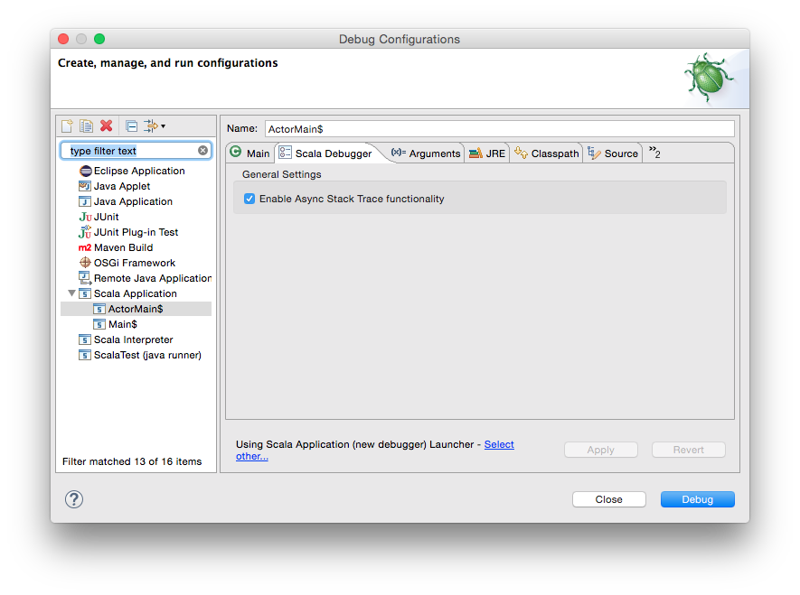
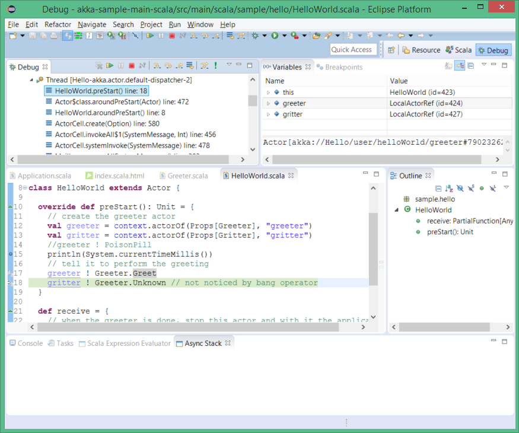
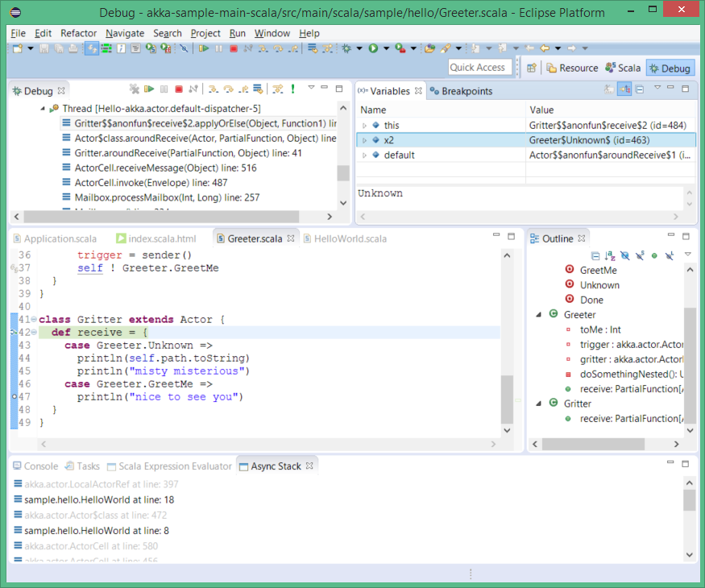
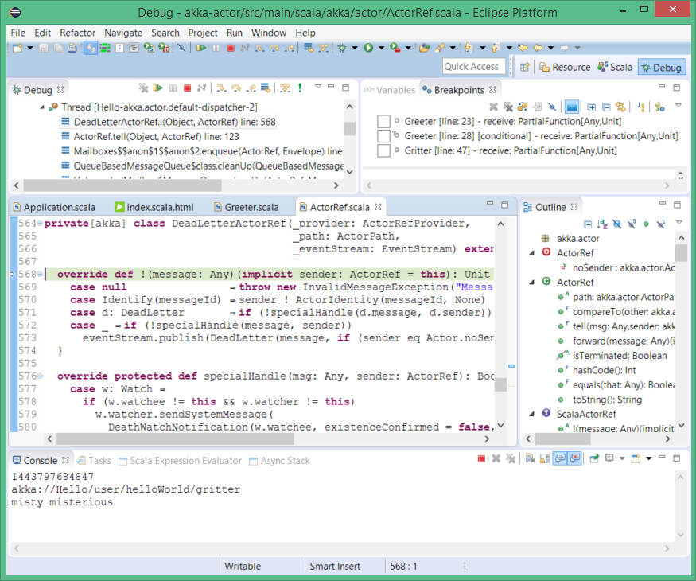

.. include:: /global_defs.hrst

Asynchronous Debugger |new|
=====================

The Asynchronous Debugger extensions facilitate debugging of applications that use actors, futures or even iteratees. There are two main features:

- Asynchronous Stack Recovery. Capture the call stack at the point where a future is created, or a message is sent to an actor.
- Step with Message. Follow a message send and stop in the receiving actor.

A few minor improvements, too:

- logical structures for actors (see at a glance the supervisor, current sender, supervising strategy)
- break on dead letters (breakpoint when a message arrives in dead letters)

For more details and demo, have a look at this `ScalaDays 2014 presentation`_

Configuration
-------------

The asynchronous extensions incur a cost on your debugged application so they need to be explicitly enabled in your Debug Configuration. Look for the additional ``Scala Debugger`` tab and enable the extensions. This tab is available on Java Debug configurations as well, to allow debugging Java Akka applications.

You can also define new *program points* where stacks are captured. A program point is defined by the fully qualified (and desugared) method name to intercept, and a 0-based index (0 being ``this``) in the method parameters. The index defines the object to which this additional stack is attached. Whenever the program is stopped at a regular breakpoint, clicking on a variable that points to that object will bring in the latest captured stack in the ``Async Stack View``.

.. image:: images/program-points.png
	:width: 100%

Async Stack
-----------

The Async Stack view is a tool which shows a time line (history) of coming Akka message or executed ``Future`` instance. To use this feature following actions need to be done:

- asynchronous extension must be ticked in specific ``Debug Configuration`` how it is described in *Configuration*
- there must be the object with history in current stack frame when breakpoint stops.

If the object with history is in current stack frame it can be clicked and then Async Stack shows its last stack trace from where this object has been triggered. Then to go back further in the past the stack frame in Async Stack can be clicked again and again up to the origin of the particular call flow.

Let's see a short example. The execution of code has been stopped in line 23. Variable view shows object (message) ``GreetMe`` which has got a time line. We also can notice in Async Stack view that message has came from line 34 of ``Greeter`` class.

.. image:: images/async-stack-1.png
    :width: 100%

Clicking on this stack trace (*sample.hello.Greeter...at line: 34*) in Async Stack view we are moved to the place in code from where this message has been sent. On other hand Variables view shows the origin message. This time it's ``GreatMe`` again.

.. image:: images/async-stack-2.png
    :width: 100%

Clicking again we end up in line 28 of ``Greeter``.

.. image:: images/async-stack-3.png
    :width: 100%

And at last we see that this series of ``GreetMe`` messages has been initiated by ``Greet`` message

.. image:: images/async-stack-4.png
    :width: 100%

If we are even more curious finally we find that first message has been sent from ``HelloWorld.preStart()`` method. Blank Async Stack view says that there is no more history.

.. image:: images/async-stack-5.png
    :width: 100%

Step with Message
-----------------

A mysterious green *bang* icon on ``Debug`` view toolbar is a next part of Async Debugger tools suite. When it is clicked and underlying code line launches a message then the code execution is continued up to a place where this message is received. In other case it works like ``step over`` action.

Let's flick thru a simple example. First stop (with breakpoint) in a part of code which emits messages.

.. image:: images/step-msg-1.png
    :width: 100%

Now we can click on *bang* and land in next line.

.. image:: images/step-msg-2.png
    :width: 100%

Assume now that we want to see where we land with message ``Unknown``. So we skip current line simply with ``step over``.

Finally pushing *bang* we see that message ``Unknown`` is handled by ``Gritter`` class.

Break on Dead Letters
---------------------

It is a counterpart of *stop on exception* in regular debugging but this time the debugging process is stopped when ``Dead Letter`` comes.

To activate this feature push the *blue envelope* on the ``Breakpoints`` view. Observe that we are going to send a ``PoisonPill`` to ``greeter``.

.. image:: images/dead-letter-1.png
    :width: 100%

Now just run debugging and expect to stop when *dead letter* is caught.

.. _ScalaDays 2014 presentation: https://www.parleys.com/tutorial/rethinking-debugger

