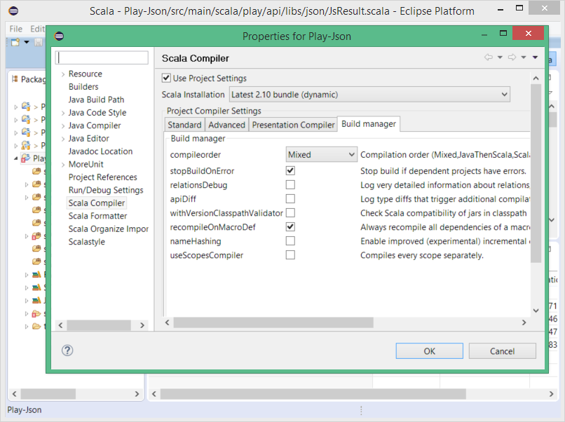
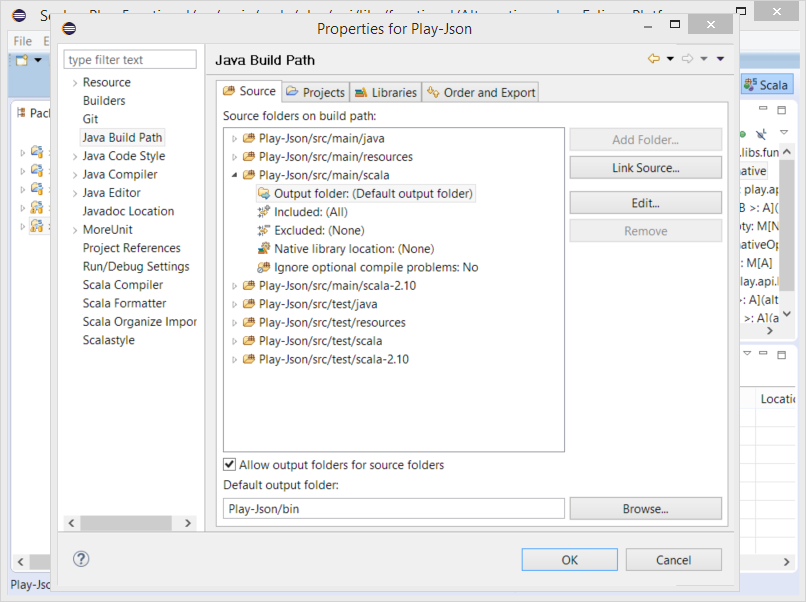
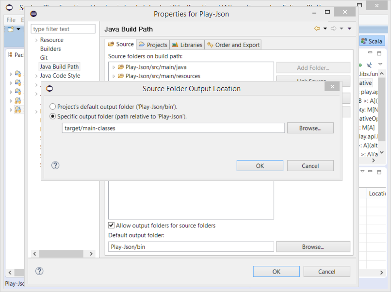

.. include:: /global_defs.hrst

Scala Scopes Building |new| (since 4.1)
=======================================

Scala IDE allows for two different ways of a project building. The old one takes all sources in a project and compiles them regardless where they are stored and what their output folders are.
The second one breaks up a project building into stages called scopes.

Scope is a set of sources which is compiled together and "a product of compilation" is stored in a specific for this set output folder.

This feature has been designed to solve a problem of **macro** compilation. Up to now **macro** code has to be moved to a separate project which the main project depends on. With Scala Scopes Building **macros** can be defined and used in the same project.

3 scopes are defined by the convention:

- ``macros`` with default source path: ``<project root>/src/macros*`` and especially for Play projects ``<project root>/conf*``
- ``tests`` with default source path: ``<project root>/src/test*`` and (because of Play projects) ``<project root>/test*``
- ``main`` which gets all source paths which don't match macros and tests scopes
\ :sub:`(\* is just a wildcard so for example tests scope encloses sources from folders src/test, src/test-my-special etc)`

The scopes are compiled in order: ``macros``, ``main``, ``tests``. The compilation is conditional so if any compilation scope fails then further scopes are not compiled anymore. So when ``macros`` compilation fails then neither ``main`` nor ``tests`` is compiled. When ``macros`` compiles successfully and ``main`` fails then ``tests`` scope is not compiled.

Of course the output folder of a particular scope is added to the classpath of the depending scopes. This means that the output of ``macros`` is added to ``main`` and ``tests`` classpaths and the output of ``main`` is added to ``tests`` classpath.

Besides of scopes dependencies in a single project there are dependencies defined across projects' scopes too. When some given project (for simplicity let name it *B*) depends on other project (let call it *A*) then the dependencies between
these two projects' scopes are determined in the following way:

- ``macros`` of *B* depends on ``macros`` and ``main`` of *A* (so ``macros`` of *B* requires a successful compilation of ``macros`` and ``main`` scopes in project *A*)
- ``main`` of *B* depends on ``macros`` and ``main`` of *A*
- ``tests`` of *B* depends on ``macros``, ``main`` and ``tests`` of *A*

Enabling scopes compilation
---------------------------

The feature is turned ``on`` by default. To suppress it go to the project properties: ``Right click on a project → Properties → Scala Compiler → Build manager`` and uncheck ``useScopesCompiler``. Clean your project afterwards.

Changing settings for an existing project
-----------------------------------------

If a project already exists you can change its settings to get the advantage of scopes compilation and resolve problems with dependent builds in the following way:

- Open the project context menu and select the path ``Right click on project → Properties → Java Build Path → Source``

- Check ``Allow output folders for source folders``

     
- Edit ``Output folder`` of chosen source folder and set your output folder. Click *Ok*

     
- Clean the project
