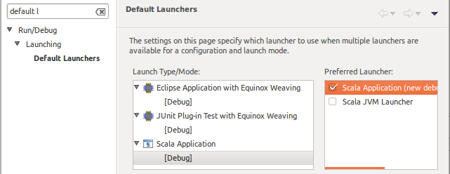
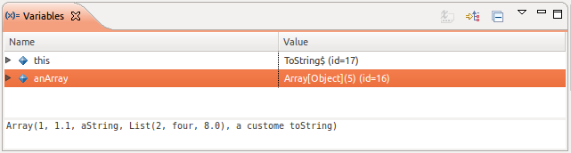
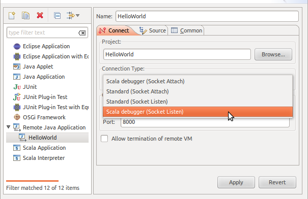

.. include:: /global_defs.hrst

Scala Debugger
==============

Goals
-----

The idea is to provide a debugger inside Scala IDE more targeted to Scala code.

The main goals are:

* Hide the artifacts created by the Scala compiler
* Have an intuitive stepping through Scala code
* Identify elements as Scala

Where to get it?
----------------

The Scala debugger is a part of Scala IDE and is released as a whole.

Using the Scala debugger
------------------------

The Scala debugger is available as an alternate debug mode launcher for the Scala applications and Equinox Weaving Eclipse applications.

It can be set as the default launcher from the ``Run\Debug → Launching → Default Launchers`` preferences:

Or it can be selected in each launch configuration:

.. image:: images/preferences-02.png
   :alt: Scala debugger switch

Features
--------

Scala-like display
..................

In the different views (debug, variables, *and more later*), the types and methods are displayed the way they would be written in Scala code.

.. image:: images/scaladisplay-01.png
   :alt: Scala-like display

toString display
................

In the variables view, the detail pane show the ``toString`` value, or its equivalent, for the currently selected entity.

Logical structures support
..........................

By default, the variables view shows the internals of each entity.

But in a lot of cases, it is not the sought after information. Using the ``Show Logical Structure`` toolbar button, the data is shown is a more synthetic way.

.. image:: images/logicalstructure-02.png
   :alt: logical structure enabled

*In the preview version, only support for List has been tested*

Smart stepping
..............

A normal Java debugger is made to debug applications written in Java. It cannot handle concept like closures.

In a situation like the following, it would jump the full ``map`` call when asked to do a 'step over'. 

.. image:: images/smartstepping-01.png
   :alt: smart stepping - initial state

The Scala debugger is able to find those and stop inside the closure. The closure variables are visible.

.. image:: images/smartstepping-02.png
   :alt: smart stepping - initial state

After an other 'step over', the debugger stops at the evaluation of the closure for the second element.

At the next 'step over', the debugger exits the map call, and stop at the assignment. After an extra 'step over', the result is visible in ``k``.

The same way, the 'step into' action allows you to step right into the closure, and the 'step out' action to return to the original call.

*In the preview version, 'step into' is not working fine with primitive types*

Step filters
............

Often when stepping in and out of Scala methods you don't want to stop in all the artifacts produced by the Scala compiler. Those includes:

* synthetic methods
* Scala getters for ``val`` members
* Scala getters and setters for ``var`` members
* getters for default argument (ending in ``$default$1,2,..``)
* forwarders for concrete trait methods

You can enable/disable step filters on the debugger configuration page:

Boxed primitive values
......................

The value of boxed primitives is extracted to be displayed.

Clean stack frame list
......................

Smart stepping 'hides' the internal details of collections and closure. This information is also hidden in the debug view, only the relevant stack frames are displayed.

Remote Debugging
................

Using the Scala debugger for a remote debugging session is done by selecting one of the Scala connector in a normal 'Remote Java Application' launch configuration. The remainder of the configuration is the same as for Java remote debugging.

Drop to frame |new| (since 4.0)
...............................

Select the ``Drop to Frame`` command to re-enter the selected stack frame in the ``Debug`` View.

.. image:: images/drop-to-frame.png
   :alt: drop to frame option in menu

.. note:: This command is only available if the current VM supports drop to frame and the selected stackframe is not in a native method.

Hot code replace |new| (since 4.1)
----------------------------------

Hot code replace adds the possibility to modify and re-compile code in a debug mode and to have these changes visible
and taken into account by the debugged VM without restarting the application.

.. note:: HCR is limited by JVM's support for replacing classes. Its goal is to allow to experiments with the code
 inside methods/blocks rather than to develop the whole application in the interactive mode. Changes of methods'
 signatures etc. do not work - similarly to other HCR implementations in Eclipse or other IDEs.

Configuration
.............

.. note:: This feature is turned off by default and can be turned on in preferences.

Multiple parameters of HCR can be configured in menu:

.. image:: images/hot-code-replace.png
   :alt: hot code replace configuration menu
   :width: 100%

Those allows to:

* enable or disable HCR,
* configure whether error messages from HCR should be shown,
* change whether files containing compilation errors should be skipped,
* automatically drop (or not) obsolete frames on suspended threads,
* and ignore obsolete frames when performing drop to frame - this one is only needed if you disable automatic drop to frame after HCR.

Expression evaluator |new| (since 4.1)
--------------------------------------

**To be described in next PR**

Further improvements and unsupported features
---------------------------------------------

*may not be exhaustive, not really ordered, updated 2015-04-27*

* Take care of breakpoints in Scala Debugger, currently still done by JDT debugger
* Use own jdi event dispatcher, instead of using the JDT debugger one
* Set the right icon according to the element type and state
* Improve the labels

  * *Running*, *Suspended*, *Terminated* suffix on debug target and thread
  * option to display simple or fully qualified types
  * clean way to display object name, without the ``$`` 

* filtered stack frames option

  * to hide some Scala internals, like collections
  * configurable list in preferences

* filter synthetic elements in the variable view
* extension point for additional support of logical structures
* use IIndexedValue for arrays
* better smart step into support

  * collection of primitive type elements

* step over and step out relative to the currently selected stackframe
* cache data used for smart stepping

  * result of findAnonFunction
  * keep enabled ClassPreparedRequests to avoid requesting *allClasses* every time

* better Scala breakpoints

  * may still need to be based on Java breakpoints
  * smarter *add breakpoint*
  * method breakpoint support
  * watchpoint support

* display the value returned by the last executed method (a proof of concept is working. Need to define the exact behavior and devise a way to present the value)

Development setup
-----------------

The Scala debugger adds 4 new plugins, 2 for debugger: ``org.scala-ide.sdt.debug``, ``org.scala-ide.sdt.debug.tests`` and 2 for expression evaluator: ``org.scala-ide.sdt.debug.expression``, ``org.scala-ide.sdt.debug.expression.tests``

In Eclipse
..........

The Scala debugger makes use of the `JDI`_ to communicate with the VM. For some valid reasons, the jdt.debug plug-in provides a non-generic version of it. The Scala debugger uses the newer generic version, so some tweaking is needed inside Eclipse.

On Mac OS X
^^^^^^^^^^^

The generic version of the JDI is included by default in the VM libraries, just remove the ``JAVA_HOME/lib/tools.jar`` entry from the Java build path to have the project to compile.

On the other OSes
^^^^^^^^^^^^^^^^^

On non-Mac OS X systems, JDI is not part of the VM default libraries. To steps are needed to have the project to compile correctly:

* create a ``Classpath Variable`` in ``Window → Preferences → Java → Build Path → Classpath Variables`` named ``JAVA_HOME``, which points to the root folder of your JDK installation.
* in ``Window → Preferences → Java → Installed JREs``, edit your JDK, and use ``Add External JARs`` to add the ``JDK_HOME/lib/tools.jar`` library.

.. _JDI: http://docs.oracle.com/javase/6/docs/jdk/api/jpda/jdi/index.html

