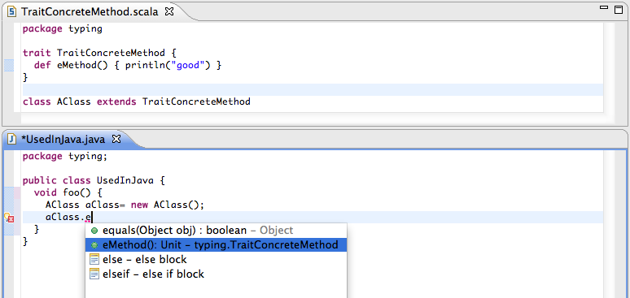

.. include:: /global_defs.hrst

Code Completion |updated|
=========================

Scala IDE provides full code completion support, returning the entities available in the current context. Code completion is enable by using ``Ctrl+Space`` in the Scala Editor.

In **Scala source files**, code completion returns the valid Scala and Java proposals.

.. image:: images/feature-code-completion-01.png
   :width: 100%
   :target: ../_images/feature-code-completion-01.png

The Scala elements compatible with Java are provided in **Java source files**.

Completion overwrites
---------------------

Users can choose if identifiers inserted by the code completion mechanism should overwrite already existing ones. This is a very useful feauture if one decides to change already existing source code. For example, if we have the following ::

  List(1).fl^map(List(_))

where ``^`` denotes the cursors position, it would not be that useful when as completion ``flatMap`` is chosen but the already existing ``map`` is not replaced. Completion overwrites allow exactly these sort of replacements. They need to be configured in ``Preferences → Java → Editor → Content Assist`` and then in the section ``Insertion``.

A small detail to mention here, is, that it is possible to toggle between the completion modes by holding ``Ctrl`` while applying the completion.
