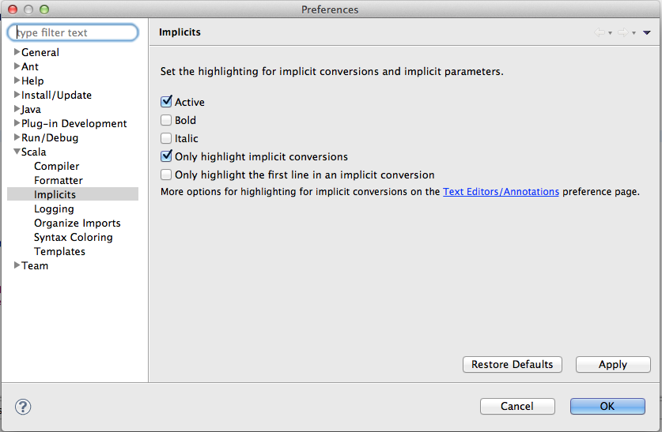

Implicit Highlighting
=====================

Implicit annotations are a very powerful feature in Scala. They allow for
fluid DSLs, an amazing collection library, or enriching existing types. With
great power comes great responsability, and a desire to control. Meet *Implicit Highlighting*!

Implicit highlighting
---------------------

.. image:: images/implicit-format.png

We have defined a class for rational numbers, and defined an implicit comversion from integers
to rationals. This way we can easily mix integers and rationals in arithmetic 
expressions, for instance by adding 42 with a rational number.

Notice that the number ``42`` is underlined, and a marker is added to the left
gutter. This signals that the method ``plus`` was added through an implicit
conversion. If you move your mouse over the gutter, you will see the actual
conversion (``intToRational``). 

.. image:: images/hover.png

There is also a QuickFix available (``CMD-1``)
that makes the call the implicit conversion explicit! Check :doc:`Expand Implicit Conversion <../quick-fixes>` for more details.

.. image:: images/quick-fix.png

Configuration
-------------

By default, only *implicit conversions* are highlighted. This makes sense,
since most of the times implicit values that are passed around are not too
costly, nor interesting. However, if you'd like to show those as well, you can
enable them from the ``Implicits`` preferences page.

Thank you
---------

This feature was contributed by Jin Mingjian and improved by David Bernard and
Mirko Stocker. Thank you!
