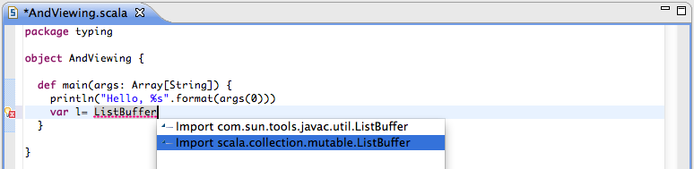
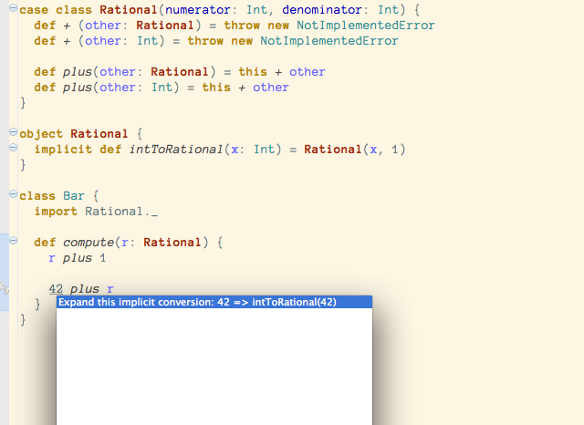

Quick Fixes
===========

Quick Fix Import
----------------

`Quick Fix`_ can be used to easily add a required import statement.

.. _typingviewing_show-inferred-semicolons:

.. _Quick Fix: http://wiki.eclipse.org/FAQ_What_is_a_Quick_Fix%3F

Expand Implicit Conversion
--------------------------

.. note::

	:doc:`Implicit Highlighting <implicit-highlighting/index>` needs to be enabled.

`Quick Fix`_ can be used to expand an implicit conversion.

