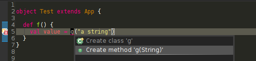
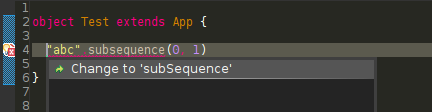
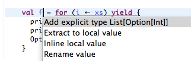

Quick Fixes
===========

Quick Fix Import
----------------

`Quick Fix`_ can be used to easily add a required import statement.

.. image:: images/feature-quickfix-import-01.png
   :width: 100%
   :target: ../_images/feature-quickfix-import-01.png

.. _typingviewing_show-inferred-semicolons:

.. _Quick Fix: http://wiki.eclipse.org/FAQ_What_is_a_Quick_Fix%3F

Expand Implicit Conversion
--------------------------

.. note::

	:doc:`Implicit Highlighting <implicit-highlighting/index>` needs to be enabled.

`Quick Fix`_ can be used to expand an implicit conversion.

.. image:: images/quick-fix.png

Create Method and Class
-----------------------

For the following code snippet there exists a quick fix for the method call of ``g``:

The result of applying this quick fix is the following::

  object Test extends App {
  
    def f() {
      val value = g("a string")
    }
  
    def g(arg: String) = {
      ???
    }
  }

As one can see in the screenshot above it is also possible to create classes, not only methods.

Change Capitalization
---------------------

If one did a type error in the name of a method, it is possible to correct this as long as the only type error is due to wrong capitalization:

Add Explicit Type
-----------------

If you want to add an explicit type to a method or a value definition, you can automatically add the inferred type. Position the cursor on the value or method definition and type ``Ctrl-1`` (or ``CMD`` for Macs). You should see a popup offering to add the explicit type, like the in the picture below:

