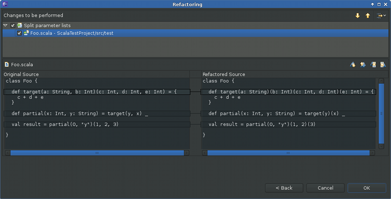
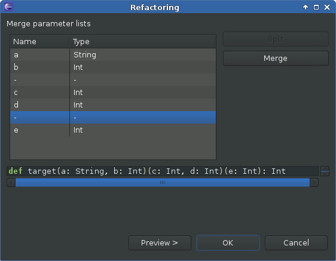
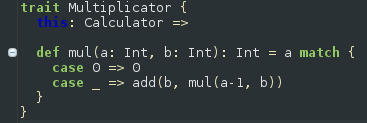
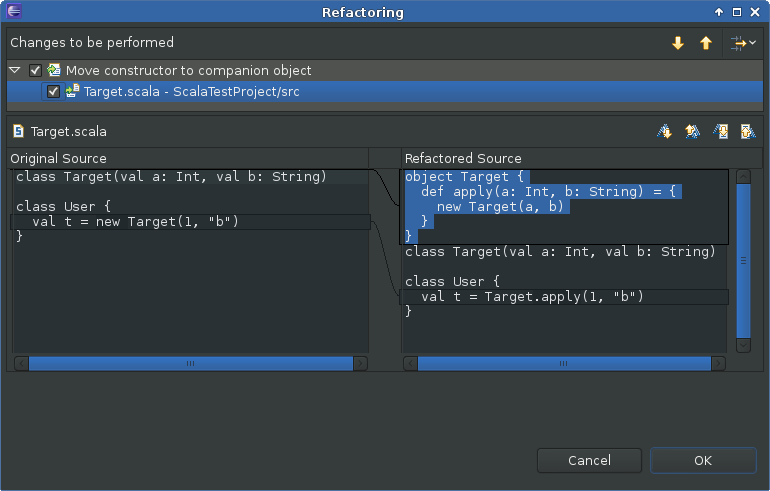

Refactoring
===========

`Scala Refactoring`_ is integrated in Scala IDE. It offers a broad range of refactoring actions.

Inlining Local Values
------------------------

The `Inline Local`_ action helps removing unneeded values.

The action is performed on the currently selected value.

.. image:: images/feature-refactoring-inline-local-01.png
   :width: 100%
   :target: ../_images/feature-refactoring-inline-local-01.png

Organizing Imports
------------------

The `Organize Imports`_ action allows to do some automated cleanup on the list of imports. It removes the unused or unneeded imports and organizes the remainder.

This action can be configure in the ``Scala → Organize Import`` preference page.

Renaming
--------

The `Rename`_ action allows to change any name, and update its reference.

The action is performed in in-line mode if the name as only a local scope.

.. image:: images/feature-refactoring-rename-01.png
   :width: 100%
   :target: ../_images/feature-refactoring-rename-01.png

The action is done through a wizard if the name can be referenced from different source files.

.. image:: images/feature-refactoring-rename-02.png
   :width: 100%
   :target: ../_images/feature-refactoring-rename-02.png

Move Class, Object or Trait Refactoring
---------------------------------------

Move Class was an often requested feature in the Scala IDE bugtracker, so we
implemented it for the upcoming 2.1 release. The refactoring can either be
invoked from the Refactoring menu, or indirectly by drag-and-dropping a file
in the Package Explorer.

If there exists more than one top-level declaration in the file, you can choose to
split-off one of the declarations or to move them all. The refactoring will move
all the necessary imports along, and also update all the references (other
imports, or qualified names) in the project.

Here is a screenshot of the refactoring configuration dialog:

.. image:: images/move-class-configuration.png

You can also create a new package directly in the wizard, and choose to move the
complete file or only the selected definition (the option is not present if no
definition was selected or if the file contains only a single one).

The resulting changes can then be previewed in the usual fashion:

.. image:: images/move-class-preview.png

A new file is created with the name of the moved class. In this preview, we can
see that the class is removed in the file and an import to its new location is
added because the class is referenced somewhere in this file.

*Limitations*

There currently are some limitations: the refactoring works only on Scala code,
and it simply ignores visibility issues, so moving might result in compilation
errors. This being the initial implementation, it is certainly not free of bugs,
so please `report any bug you encounter
<http://scala-ide-portfolio.assembla.com/spaces/scala-ide/support/tickets>`_.

Method signature refactoring
----------------------------

All three method signature refactoring not only apply the refactoring to all usages of a method throughout the inheritance hierarchy, they also track its partial applications.

Change parameter order
~~~~~~~~~~~~~~~~~~~~~~

The order of the parameters in your method should be changed? *Change parameter order* allows you to reorder method parameters inside each parameter list.

To reorder the parameters of a method select its definition:

In the refactoring dialog the parameters can be moved up and down in their parameter lists. The preview of the refactored method signature is always updated accordingly:

.. image:: images/change-order-dialog.png

All changes are displayed in the preview dialog:

.. image:: images/change-order-preview.png

*Limitations*

Changing of parameter order currently doesn't play well together with default and named arguments. This will hopefully be improved soon.

Split parameter lists
~~~~~~~~~~~~~~~~~~~~~

You want to partially apply your method but it has not enough parameter lists? *Split parameter lists* allows you to split parameter lists between each two parameters.

Again, just select the method to refactor:

.. image:: images/split-before.png

In the refactoring dialog parameter lists can be split between each parameter pair using the *Split* button. A split can be reverted by using the *Merge* button.

.. image:: images/split-dialog.png

And the resulting changes in the preview dialog:

Merge parameter lists
~~~~~~~~~~~~~~~~~~~~~

Your method doesn't need multiple parameter lists? Being the inverse refactoring to *Split parameter lists*, *Merge parameter lists* merges parameter lists that don't need to be split.

The refactoring dialog is very similar to *Split parameter lists*:

Having merged the right parameter lists we get back our original method signature from the beginning, before we applied the *Split parameter lists* refactoring:

.. image:: images/merge-preview.png

Note that there are situations where parameter lists can't be merged because they are partially applied. As an example, we can't merge the remaining two parameter lists of the method ``reorder`` because of the partial application in the method ``partial``:

.. image:: images/merge-not-possible.png

Extract trait
-------------

*Extract trait* moves selected members from a class/object/trait to a new trait. If the new trait accesses non-private members of the original class/object/trait, a self type annotation is added to the new trait.

We start with a simple ``Calculator`` class:

.. image:: images/extract-trait-before.png

We select the ``mul`` method for extraction in the dialog and give the new trait the name ``Multiplicator``:

.. image:: images/extract-trait-dialog.png

The class ``Calculator`` is changed accordingly:

.. image:: images/extract-trait-preview.png

The new trait ``Multiplicator`` uses the ``add`` method from ``Calculator``, so a self type annotation needs to be added to ``Multiplicator``:

Import statements are also handled: In the original class/object/trait all import statements that are not used after the extraction of the trait are removed, and in the extracted trait all needed import statements are added.

*Limitations*

The currently supported member types are: def, val and var. Others, as e.g. nested classes, are not (yet) supported.

Move constructor to companion object
------------------------------------

You want to create a factory method such that the constructor of your class is not accessed directly, but tracking down and redirecting all constructor calls is cumbersome? Then *Move constructor to companion* object is here to help! It creates an ``apply`` method in the companion object (which is generated as well if necessary) that calls the constructor. All constructor calls get redirected to the new factory method.

As a simple example we start with a ``Target`` class and a class ``User`` that calls ``Target``'s constructor:

.. image:: images/move-constructor-before.png

Selecting the ``Target`` class and applying the *Move constructor to companion object* refactoring creates a companion object and an ``apply`` method that wraps the constructor call. The constructor call in the ``User`` class is redirected to the new factory method.

*Limitations*

Currently this is only supported for the primary constructor (thus no refactoring dialog is needed), moving auxiliary constructors is not (yet) possible.

.. _Inline Local: http://scala-refactoring.org/inline-local/
.. _Organize Imports: http://scala-refactoring.org/organize-imports/
.. _Rename: http://scala-refactoring.org/rename/
.. _Scala Refactoring: http://scala-refactoring.org/

