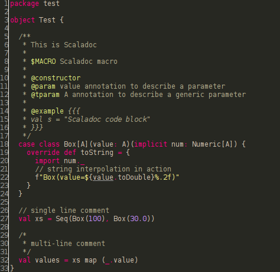
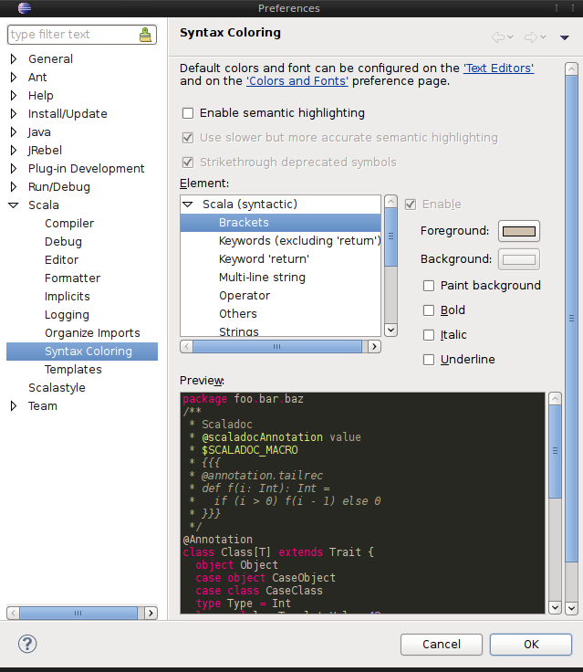

Syntax Highlighting
===================

The Scala editor has full syntax highlighting support, including comments, control structures and embedded XML.

.. image:: images/feature-syntax-highlighting-01.png
   :width: 100%
   :target: ../_images/feature-syntax-highlighting-01.png

As one can see in the following preview, syntax highlighting works not only for Scala code, but also for Scaladoc and for string interpolation:

In the following picture there are all literals shown that are available in Scala. Note that escape sequences are shown in string and char literals as well as Unicode and octal sequences.

.. image:: images/literals.png

Configuration
-------------

There are several options available how syntax highlighting can be configured. Beside the possibility to set fore- and background color it is possible to paint the text in bold and italic or to underline it.

