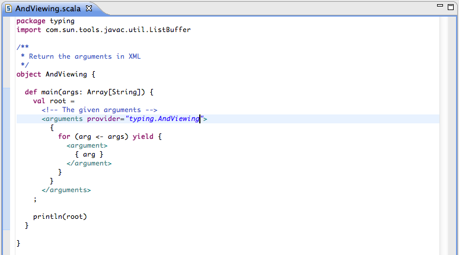
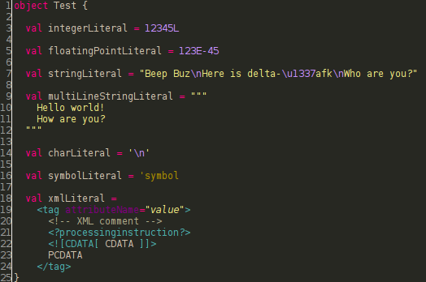

Syntax Highlighting
===================

The Scala editor has full syntax highlighting support, including comments, control structures and embedded XML.

As one can see in the following preview, syntax highlighting works not only for Scala code, but also for Scaladoc and for string interpolation:

In the following picture there are all literals shown that are available in Scala. Note that escape sequences are shown in string and char literals as well as Unicode and octal sequences.

Inside of comments, the editor supports the feature to highlight so called task tags, also known as todo markers:

.. image:: images/todo-markers.png

Because this is a feature JDT supports too, they are not implemented as a complete separate feature. Instead, SDT uses the markers already defined by JDT, which can be found and configured in ``Preferences → Java → Compiler → Task Tags``. The task tags can also be shown on the right and left side of the editor as so called Annotations. These Annotations can be configured in ``Preferences → General → Editors → Text Editors → Annotations``. Furthermore it is possible to view the them in the Tasks View that can be found in ``Window → Show View → Other... → General → Other``.

Configuration
-------------

There are several options available how syntax highlighting can be configured. Beside the possibility to set fore- and background color it is possible to paint the text in bold and italic or to underline it.

.. image:: images/preferences.png
