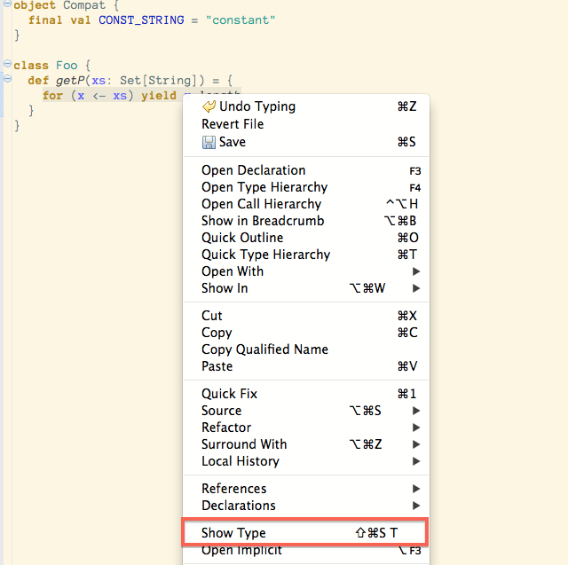
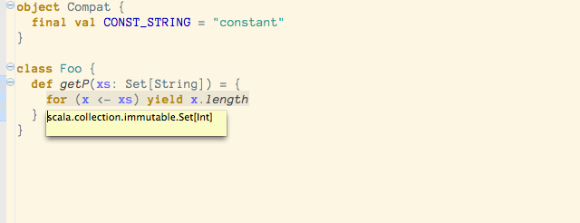

Show Type of Selection
======================

It often happens that during development you'd like to know what is the type of a Scala expression. This can
be very handy when 'debugging' a type error, for instance inside a for comprehension, or a pattern match.

Similarly to the hover window, you can invoke the ``Show Type`` command on any expression, and get back the type
of selection. Of course, this relies on the expression being type-correct.

If you choose ``Show Type`` an overlay window will appear, showing the inferred type of the selection.

