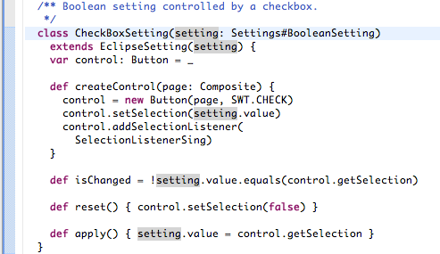
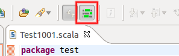

Documentation update from Hydrogen
==================================

This lists updates to the current which have to be merged at release time

.. warning::

   **Images! Links!**

   When the elements in this page are merged in the main doc, double check the path of the images and relative links, as they may be different.

(from user/features/typing and viewing)

Mark Occurrences
----------------

As in the Java tooling, Mark Occurrences highlights within a file where a type, variable or method is referenced.

This feature is disabled by default, but can be enabled in the ``Scala -> Editor`` preference page, or using the button in the main toolbar.

