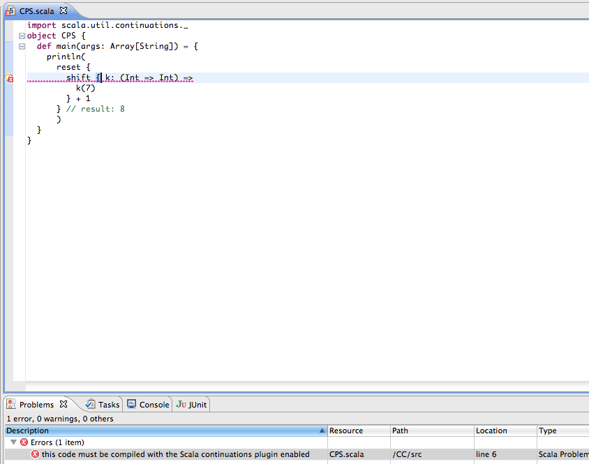
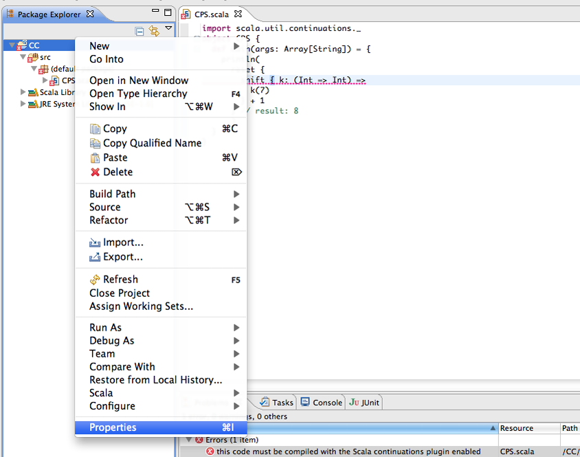
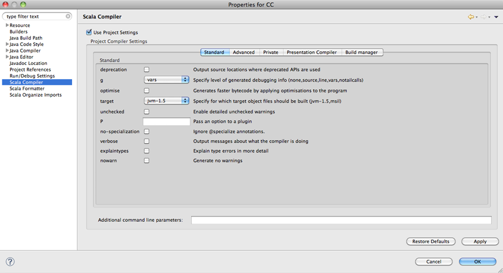
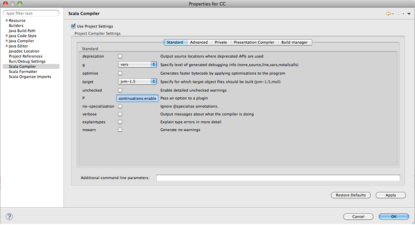
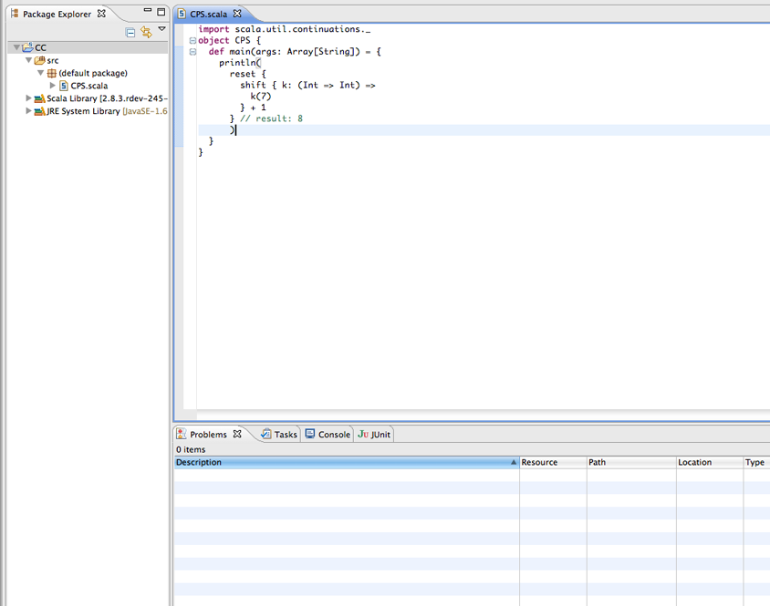

Enabling Scala continuations plugin in the Scala IDE
====================================================

Prerequisites
.............

*   `Eclipse`_ 3.6 (Helios) with a `Scala IDE 2.0`_ installed, or 
    `Eclipse`_ 3.7 (Indigo) with a `Scala IDE Helium nightly`_ installed.

    Check the :ref:`getting started <gettingstarted_getting-started>` page for instructions on how to install Scala IDE.

*   A basic knowledge of the Eclipse user interface is required.

*   No knowledge of the Scala language is required (in this guide).

Introduction
------------

In this tutorial you will learn how to enable continuations in the Scala IDE. Scala provides 
support for `continuation-passing style`_ through a compiler plugin, which is shipped together with 
the main Scala distribution. 

Enabling continuations in Scala 2.9 is really simple, you only need to pass 
``-P:continuations:enable`` to the Scala compiler, and the continuations plugin will be loaded and 
used to compile your sources.

In this tutorial we will learn how to enable the continuations plugin with the Scala IDE for Scala 2.9.

Enabling continuations plugin
-----------------------------

Assume you have a source file requiring the continuations plugin to be enabled. Chances are that in 
the Problems view you will get an error message such as: *this code must be compiled with the Scala 
continuations plugin enabled*.

Let's fix this!
Right click on your project folder and select Properties.

Then, under Scala Compiler, click on **Use Project Settings**.

Now, write **continuations:enable** in the ``P`` field.

`Apply` then `Ok` to close the properties window. The errors should go away (if that is not the 
case, rebuild your sources).

That's it! You have successfully enabled continuations in your project.

Known Problems
--------------

Unfortunately, we found out that plugin settings in the Scala IDE 2.0.0 are not always correctly 
handled. The good news is that the issue has been fixed, and the patch is already available in both 
the `Scala IDE 2.0.x` nightly and the `Scala IDE Helium` nightly. 

If you are using the Scala IDE 2.0.0 and the above step-by-step description does not work in your 
case, we suggest you to do the following:

1. Pass to ``-Xplugin`` the path to the ``continuations.jar``. 
	
	* **Important:** Make sure that the path contains **no whitespaces**.
	
2. Pass ``continuations:enable`` to the ``P`` compiler setting.

But the best suggestion we have is to use the `Scala IDE 2.0.x nightly`_, if you can do so.

Feedback
--------

This guide is managed through in the `Scala IDE documentation project`_ on github.
Please use github tickets and pull requests system for feedback.

Mirco Dotta - `@mircodotta`_

.. _continuation-passing style: http://en.wikipedia.org/wiki/Continuation-passing_style
.. _Scala IDE documentation project: https://github.com/scala-ide/docs
.. _Eclipse: http://www.eclipse.org/
.. _Scala IDE 2.0: http://scala-ide.org/download/current.html
.. _Scala IDE 2.0.x nightly: http://scala-ide.org/download/nightly.html
.. _Scala IDE Helium nightly: http://scala-ide.org/download/nightly.html
.. _@mircodotta: https://twitter.com/mircodotta
