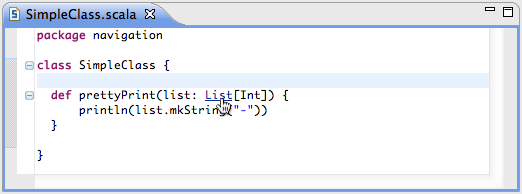
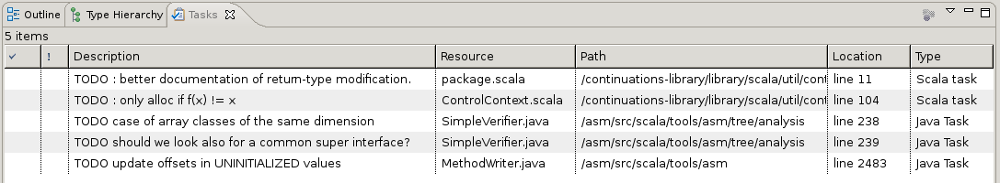

Navigating
==========

Open type
---------

The ``Open Type`` dialog used to find Java type also provide all defined Scala types. The shortcut is ``Ctrl-Shift-T`` or ``Cmd-Shift-T``.

.. image:: ../images/feature-open-type-01.png

Hyperlinking
------------

Hyperlinking to declaration is enable in the Scala editor.

It is activated by holding the ``Ctrl`` or the ``Cmd`` key, and hovering on variable, method or type. It became underlined and can be click to jump to its declaration.

Open declaration
----------------

In a similar way to hyperlinking, ``F3`` can be used to the declaration of the element currently under the caret.

Outline View
------------

The outline view of the standard Eclipse editors is also supported for the Scala IDE ! Hit `Alt + Shift + Q, O` to bring it up. You will be able to see eclarations for package, class, member, etc.

.. image:: ../images/outline-view-2.png

The outline view is also linked to your editor : clicking on members in the Outline view focuses your editor to the region of text where that element is declared. In a large file, this may be very useful.

.. image:: ../images/outline-view-1.png

A lighter version of the same feature is available if you press `Ctrl + O` (`Command + O` on Mac) with the focus on the current editor.

.. image:: ../images/quick-outline-1.png

Tasks View
----------

The Scala IDE will also look through your comments and list TODO or FIXME mentions in the Tasks view. You can then navigate to them by clicking on them. The Tasks view can be brought up by clicking on `Alt + Shift + Q, K`.`

