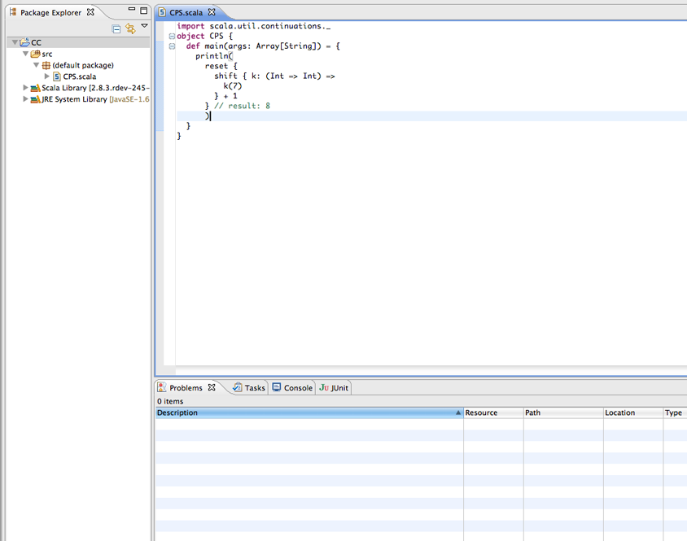

Enabling the Scala continuations in the Scala IDE
=================================================

Prerequisites
.............

*   `Eclipse`_ 3.6 (Helios) with `Scala IDE 2.0`_ installed, or 
    `Eclipse`_ 3.7 (Indigo) with a `Scala IDE nightly`_ installed.

    Check the :ref:`getting started <gettingstarted_getting-started>` page for instructions on how to install Scala IDE.

*   A basic knowledge of the Eclipse user interface is required.

*   No knowledge of the Scala language is required (in this guide).

Introduction
------------

In this tutorial you will learn how to enable continuations in the Scala IDE. Scala provides 
support for `continuation-passing style`_ through a compiler plugin, which is shipped together with 
the main Scala distribution. Enabling continuations in Scala is really simple, you only need to 
pass ``-P:continuations:enable`` to the Scala compiler, and the continuations plugin will be loaded 
and used to compile your sources. The good news is that enabling continuations in the Scala IDE is 
exactly the same!

Enabling continuations plugin
-----------------------------

Assume you have a source file requiring the continuations plugin to be enabled. Chances are that in 
the Problems view you will get an error message such as: *this code must be compiled with the Scala 
continuations plugin enabled*.

.. image:: images/1-continuations-disabled.png
  :alt: Errors dues to disabled continuations plugin 
  :width: 100%
  :target: ../../_images/1-continuations-disabled.png

Let's fix this!
Right click on your project folder and select Properties.

.. image:: images/2-project-properties.png
  :alt: Open the project properties 
  :width: 100%
  :target: ../../_images/2-project-properties.png

Then, under Scala Compiler, click on **Use Project Settings**.

.. image:: images/3-use-project-settings.png
  :alt: Use project settings
  :width: 100%
  :target: ../../_images/3-use-project-settings.png

Now, write **continuations:enable** in the ``P`` field.

.. image:: images/4-enable-continuations-plugin.png
  :alt: Enable the continuations plugin
  :width: 100%
  :target: ../../_images/4-enable-continuations-plugin.png

`Apply` then `Ok` to close the properties window. The errors should go away (if that is not the 
case, rebuild your sources).

That's it! You have successfully enabled continuations in your project.

Feedback
--------

This guide is managed through in the `Scala IDE documentation project`_ on github.
Please use github tickets and pull requests system for feedback.

Mirco Dotta - `@mircodotta`_

.. _continuation-passing style: http://en.wikipedia.org/wiki/Continuation-passing_style
.. _Scala IDE documentation project: https://github.com/scala-ide/docs
.. _Eclipse: http://www.eclipse.org/
.. _Scala IDE 2.0: http://scala-ide.org/download/current.html
.. _Scala IDE nightly: http://scala-ide.org/download/nightly.html
.. _@mircodotta: https://twitter.com/mircodotta
